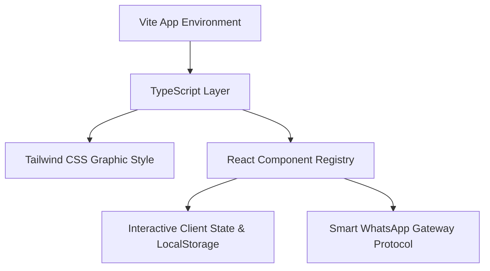

# 🌴 Temeling Jungle Inn — Premium Nusa Penida Adventure Portal 🌊

[](https://vitejs.dev/)
[](https://react.dev/)
[](https://tailwindcss.com/)
[](https://www.typescriptlang.org/)
[](https://opensource.org/licenses/MIT)

> **"Bhai, ye Nusa Penida ka ultimate travel hub experience hai!"** 
> A next-generation, high-performance, and visually stunning 3D-tactile travel booking platform tailored specially for **Temeling Jungle Inn** in Nusa Penida, Bali. Equipped with real-time quote engines, custom day-itinerary planners, interactive backoffice dashboards, and automated seamless WhatsApp checkout loops.

---

## ✨ Spectacular Highlights & Features

### 🎨 1. Premium 3D & Tactile Glassmorphic UI/UX
*   **3D Pushable Buttons:** Super interactive pushable buttons (`.pushable-btn-action`) with realistic spring-loaded clicking behavior.
*   **Dimensional Shadows:** Deep, lush emerald layers (`.premium-shadow-3d`) mimicking realistic ambient environment light drops.
*   **Hover Elevations:** Tour packages and service cards slide upwards smoothly, creating a tactile spatial interface.
*   **Micro-Animations:** Fluid, staggered, and hardware-accelerated transitions via tailwind utilities.

### 🗺️ 2. Dynamic Customized Itinerary Builder (TripPlanner)
*   **Check & Add Sights:** Interactive destination selector featuring high-fidelity local tourist icons (Kelingking Cliff, Diamond Beach, Crystal Bay, Tembeling Pools).
*   **Smart Logistics Engine:** Instantly calculates estimated duration hours, local private car rates, and real-time boat feasibility constraints.
*   **Safety Threshold Alerts:** Warns customers proactively if their selected list exceeds high-stress timing thresholds.

### 💬 3. Smart WhatsApp Checkout Routing
*   No database friction, zero prepayment requested, and pure trust-based hospitality.
*   Formulates perfectly clean, emoji-styled markdown order logs and automatically launches WhatsApp click-to-chat with local Sakti guiding coordinators.

### 🛡️ 4. Secret Admin Backoffice Dashboard
*   **Access Path:** Simply toggle the "Backoffice Dashboard System" in the navigation or footer!
*   **Enterprise Metrics:** Real-time visual cards tracking company estimated revenues, booking volume, pending trip alerts, and average capacity.
*   **Dynamic Data Seeding:** Instantly add or modify tours, edit promotional banner discounts, and live-update site metadata settings (custom SEO titles/keywords list).

---

## 🛠️ The Ultimate Tech Stack



*   **⚡ Bundler:** Vite (Ultra-fast Hot Module Replacement / Build System)
*   **⚛️ Library:** React 18+ (Functional hooks, conditional layouts structure)
*   **💅 Styling:** Tailwind CSS 4.0 configuration (Lush emeralds, charcoal slates, warm whites)
*   **🔧 Icons:** `lucide-react` (High-contrast vector icons)
*   **🗄️ Persistence:** Lightweight durable Client `localStorage` engines for continuous catalog overrides.

---

## 📂 Elegant Directory Structure

```bash
├── 📁 src/
│   ├── 📁 components/             # Premium Modular UI Sub-Components
│   │   ├── 📄 AdminPanel.tsx      # Advanced Backoffice CRM Dashboard
│   │   ├── 📄 BookingModal.tsx    # Responsive Guided Booking Dialog & WA Dispatch
│   │   ├── 📄 Hero.tsx            # Main Landing Stage with Live Quote Calculator
│   │   ├── 📄 Navbar.tsx          # Dual-Mode Sticky Navigation Header
│   │   ├── 📄 PackagesGrid.tsx    # Tour Package Grid with Detail Modals
│   │   ├── 📄 ServicesPanel.tsx   # Visual Service Offerings Cards
│   │   └── 📄 TripPlanner.tsx     # Custom Itinerary Calculator Engine
│   ├── 📁 data/
│   │   └── 📄 initialData.ts      # Default Nusa Penida Guided Tours Data
│   ├── 📄 App.tsx                 # Core App Shell & Global State Handler
│   ├── 📄 index.css               # Global Tailwind CSS & 3D Layering Styles
│   ├── 📄 types.ts                # TypeScript Types & Interfaces Declarations
│   └── 📄 main.tsx                # App Bootstrap Entrypoint
├── 📄 package.json                # Project Dependencies Configuration Metadata
└── 📄 vite.config.ts              # Vite Compiler Config
```

---

## 🚀 Rapid Development & Setup

### 1. Pre-requisites
Ensure you have the latest stable [Node.js](https://nodejs.org/) installed on your machine.

### 2. Install Dependencies
Kickstart the repository libraries setup using:
```bash
npm install
```

### 3. Run the Development Server
Fire up the local container dev server on port `3000`:
```bash
npm run dev
```

### 4. Build for Production
Bundle the web assets for ultra-optimized server delivery:
```bash
npm run build
```

---

## 💎 Custom 3D CSS Classes Guide

We created dedicated design utilities inside `src/index.css` for instant 3D premium rendering:

### The Pushable Tactile Button
```html
<button class="pushable-btn-action">
  <span class="pushable-btn-shadow"></span>
  <span class="pushable-btn-edge"></span>
  <span class="pushable-btn-front">
    Push Me For Action! ⚡
  </span>
</button>
```

### Premium Slanted Level 1 Card
```html
<div class="premium-card-level-1">
  <!-- Content looks beautiful with realistic 3D shadow depth and high bottom emerald border -->
</div>
```

---

## 🏆 Local Bali Eco-Tourism Support
All calculations and parameters are adjusted with utmost respect to the native **Sakti Village** shuttle operators, private guides, fastboat vendors, and local Penida reef protection alliances. 

*Designed with ❤️ around the magical rainforest of Tembeling, Nusa Penida.*
